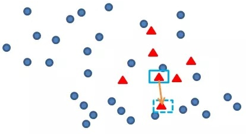
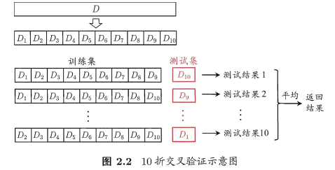

```{r setup, include=FALSE, warning = FALSE}
options(htmltools.dir.version = FALSE)
library(xaringanthemer)
style_duo_accent(primary_color = "#23395b",text_color = "#23395b",text_bold_color = "#C73E3A", title_slide_background_color = "FFFFFF",title_slide_text_color = "#23395b")
```

# Work Content


### 修改xgboost算法

- 使用**scutr**包平衡训练集

- 对训练集进行**十折交叉验证**

  - 修改xgboost模型参数，使用线性分类器booster="gblinear", 准确率提高至**93.48%**
  
- **pROC**包绘制ROC曲线


---
# Work flow

```{r echo=FALSE}
library(DiagrammeR)
grViz("digraph flowchart {
      # node definitions with substituted label text
      node [fontname = Helvetica, shape = rectangle]        
      tab1 [label = '@@1']
      tab2 [label = '@@2']
      tab3 [label = '@@3']
      tab4 [label = '@@4']
      tab5 [label = '@@5']
      tab6 [label = '@@6']
      # edge definitions with the node IDs
      tab1 -> tab2 -> tab3 -> tab4 -> tab5 -> tab6;
      }
      [1]: '划分训练集和测试集'
      [2]: 'scutr包平衡训练集'
      [3]: '数据预处理'
      [4]: '十折交叉验证训练集'
      [5]: '模型预测'
      [6]: '绘制ROC曲线'
      ")
```


---
# Package scutr

- **SMOTE** and **cluster-based undersampling** technique

- **SMOTE算法原理：**合成少数类**过采样**方法  

  - 随机选取一个少类正样本
  - 找到该样本的K个邻近
  - 随机从k个领近中选取一个样本
  - 在正样本和随机选的邻近之间的连线上随机选取一点，即人工合成的新正样本
  
- **undersampling:**从多数类别中删除样本


---
# 数据预处理

```{r echo=FALSE}
library(DiagrammeR)
grViz("digraph flowchart {
      # node definitions with substituted label text
      node [fontname = Helvetica, shape = rectangle]        
      tab1 [label = '@@1']
      tab2 [label = '@@2']
      tab3 [label = '@@3']
      tab4 [label = '@@4']
      # edge definitions with the node IDs
      tab1 -> tab2 -> tab3 -> tab4;
      }
      [1]: '自变量转换为稀疏矩阵'
      [2]: '因变量转换为数值型变量'
      [3]: '自变量、因变量拼接为list'
      [4]: '构造模型需要的xgb.DMatrix'
      ")
```

---
# 交叉验证法（cross-validation）

- **原理：**

  

- **优点：**交叉验证通过寻找最佳模型的方式来解决过拟合，适用于小数据集
- **缺点：**增加了计算量
- **用法：**

  library(caret)  
  names(getModelInfo())  #Caret中train支持的method


---

class: middle,center

# Thanks


